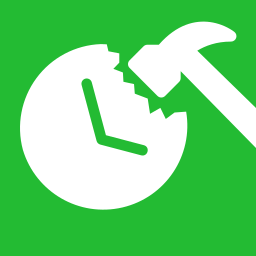
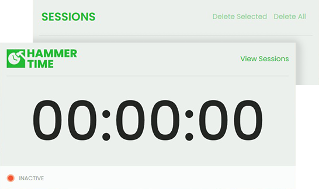

Hammer Time is a tool designed for creators using Valve's Hammer Editor, providing per-project usage statistics and streamlining the launch process.

Supports both Hammer & Hammer Plus Plus

---------
<br>



Download
---------
You can grab the latest version from the [release section](https://github.com/braddotwav/HammerTime/releases)

Arguments
---------
HammerTime supports several optional arguments that you can use to tailor the experience to your preferences.

| Argument                    | Description                                    |
|:----------------------------|:-----------------------------------------------|
| `--hammer=PATH`            | The path to the Hammer executable. Once set, HammerTime will display a launch button in the application. |
| `--launchonstart`               | When used in conjunction with the ```--hammer``` command, this option will automatically launch Hammer as soon as HammerTime starts. |

Questions & Issues
---------
If you encounter a bug or have any questions, please feel free to open an issue with the appropriate label.

Resources & Packages used
---------
- [CommandLine](https://github.com/commandlineparser/commandline)
- [Bootstrap Icons](https://icons.getbootstrap.com/)
- [Notification.Wpf](https://github.com/Platonenkov/Notification.Wpf)

License
---------
This project is licensed under the [MIT License](https://www.google.com)